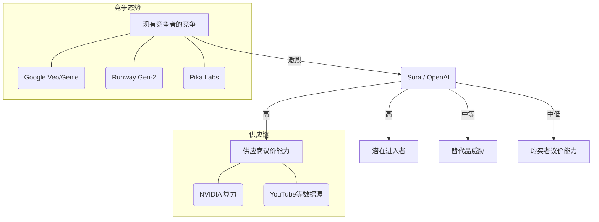

# OpenAI Sora 技术影响力深度分析报告

**报告编号：** TR-2024-AI-003
**发布日期：** 2024年5月
**分析师：** 技术分析师团队

---

## 1. 标题和摘要

### 1.1 报告标题
**OpenAI Sora 技术影响力深度分析：从“世界模拟器”视角看生成式AI的范式转移**

### 1.2 执行摘要
OpenAI 发布的 Sora 标志着生成式 AI 从文本、图像向物理世界动态模拟的关键跨越。本报告基于 SWOT、PEST、波特五力及价值链分析框架，得出以下核心发现：

1.  **技术范式转移：** Sora 验证了 DiT (Diffusion Transformer) 架构在视频生成领域的扩展性，其核心突破在于对物理世界规律的涌现式理解，而非单纯的像素拼接，这使其具备了成为“世界模拟器”的雏形。
2.  **产业价值链重塑：** 传统影视制作、广告创意及游戏资产生成流程将被高度压缩，内容生产的边际成本趋近于零，价值链重心将从“制作技能”向“创意构思”和“数据治理”转移。
3.  **竞争格局分化：** 行业进入“军备竞赛”阶段，科技巨头凭借算力与数据优势构建护城河，而垂直领域应用厂商面临技术被底层大模型“吞噬”的风险，行业整合加速。
4.  **监管与伦理挑战：** 深度伪造带来的信任危机及版权归属问题将成为制约其商业落地的最大阻碍，全球范围内针对 AI 生成内容的强制性标识法规将加速出台。

---

## 2. 主体分析

### 2.1 分析框架说明
本报告综合运用以下分析框架，以确保分析的全面性和深度：
- **PEST 分析：** 评估宏观环境对 Sora 技术发展的影响。
- **波特五力模型：** 剖析生成式视频领域的行业竞争态势。
- **价值链分析：** 探讨 Sora 如何改变数字内容产业的价值创造过程。
- **SWOT 分析：** 总结 Sora 自身的战略定位。

### 2.2 PEST 分析：宏观环境洞察

#### 2.2.1 政治
- **监管压力：** 随着全球多国大选临近，AI 生成虚假视频的扩散引发政治恐慌。美国、欧盟及中国已加速推进 AI 监管立法（如欧盟《人工智能法案》），要求对生成内容进行强制性水印标注。
- **地缘政治：** 高端 AI 芯片（如 NVIDIA H100）的出口管制可能限制 Sora 在全球范围内的普及速度，导致技术鸿沟扩大。

#### 2.2.2 经济
- **成本结构变革：** 视频制作成本将从“高昂的人力与设备成本”转变为“算力成本与提示词工程成本”。据估算，短视频制作成本可能降低 90% 以上。
- **市场规模：** 生成式 AI 市场预计将以 CAGR 35% 的速度增长，视频生成将成为继文本、图像之后的第三大增长极，预计撬动千亿级美元市场。

#### 2.2.3 社会
- **就业冲击：** 初级视频剪辑师、特效师及部分影视从业者面临极高的替代风险。社会对“真实性”的定义面临重构，视觉内容的公信力下降。
- **创作民主化：** 创作门槛降低，个人创作者具备了产出好莱坞级视觉效果的能力，长尾内容供给将爆发式增长。

#### 2.2.4 技术
- **架构创新：** Sora 采用的 **Diffusion Transformer (DiT)** 架构，结合了 Transformer 的全局语义理解能力和 Diffusion 模型的生成质量，解决了长视频的一致性问题。
- **物理世界模拟：** Sora 展现了无需显式编程即可学习物理规律（如重力、遮挡、碰撞）的“涌现”能力，这是通往 AGI（通用人工智能）的重要里程碑。

### 2.3 波特五力分析：行业竞争格局

**分析详情：**

1.  **现有竞争者的竞争（强）：** Google 迅速推出了 Veo 和 Genie，Runway、Pika Labs 等初创公司也在快速迭代。OpenAI 虽然处于领先地位，但技术壁垒尚未完全固化，各家在生成时长、连贯性和分辨率上展开激烈角逐。
2.  **潜在进入者威胁（强）：** 拥有海量视频数据的平台（如 TikTok, YouTube/Google, Meta）具备天然的护城河，随时可能推出竞品。此外，开源社区正在快速追赶，降低技术门槛。
3.  **供应商议价能力（极强）：** 底层算力供应商（如 NVIDIA）掌握着训练大模型的命脉，GPU 供给短缺和价格波动直接影响 Sora 的训练成本和推理普及。
4.  **购买者议价能力（中等）：** 对于企业级用户，转换成本较低，可尝试不同模型。但由于目前顶尖模型稀缺，用户议价能力受限。
5.  **替代品威胁（弱）：** 传统视频制作方式（实景拍摄、CGI 动画）成本高昂，在特定场景下将被迅速替代，但在需要极高精准度和法律合规性的场景中，传统方式暂时不可替代。

### 2.4 价值链分析：内容产业的重构

Sora 的出现将传统视频内容价值链进行了大幅缩短和重构。

**传统价值链：**
> 剧本创作 -> 分镜设计 -> 搭建场景/选角 -> 拍摄 -> 后期剪辑 -> 特效合成 -> 渲染输出 -> 分发

**Sora 驱动的新价值链：**
> **提示词工程** -> **模型生成** -> **后期筛选/修正** -> 分发

**关键洞察：**
- **价值转移：** 价值从“执行层”（拍摄、剪辑、特效）向“概念层”（创意、剧本、Prompt 编写）转移。
- **新环节诞生：** “AI 视频精修师”和“提示词工程师”将成为关键岗位，负责解决 Sora 生成视频中可能出现的物理错误或细节瑕疵。
- **资产化加速：** 视频素材将像库存图片一样，实现即时生成和定制化生产，库存视频商业模式面临崩溃。

### 2.5 SWOT 分析：Sora 的战略定位

| 维度 | 内容分析 |
| :--- | :--- |
| **Strengths (优势)** | 1. **技术领先性：** 长达 60秒 的连贯生成能力及物理模拟涌现能力。 2. **生态系统：** 依托 OpenAI 的 GPT-4 生态，具备极强的多模态理解能力。 3. **数据优势：** 早期访问权限带来的数据飞轮效应。 |
| **Weaknesses (劣势)** | 1. **物理准确性不足：** 仍存在“物体消失”、“空间扭曲”等幻觉问题。 2. **算力成本高：** 推理成本远高于文本和图像生成，商业化定价压力大。 3. **不可控性：** 精确控制镜头细节、角色一致性的能力仍需加强。 |
| **Opportunities (机会)** | 1. **VR/AR 内容填充：** 为苹果 Vision Pro 等空间计算设备提供海量 3D 内容。 2. **视频游戏资产生成：** 实时生成游戏场景，改变游戏开发模式。 3. **教育与培训：** 低成本生成模拟教学视频。 |
| **Threats (威胁)** | 1. **法律诉讼：** 艺术家集体诉讼和版权纠纷（纽约时报诉OpenAI案的延伸）。 2. **监管封锁：** 各国对深度伪造的严格监管可能限制功能开放。 3. **开源替代：** Stable Video Diffusion 等开源模型的快速迭代。 |

---

## 3. 结论和建议

### 3.1 核心结论
Sora 不仅仅是一个视频生成工具，它是通往物理世界模拟的关键一步。其技术本质是将视觉数据转化为时空 Patch 进行预测和生成，这种“数据驱动的物理引擎”特性，意味着它有潜力颠覆影视、游戏、广告及教育等多个千亿级市场。然而，技术成熟度（尤其是物理一致性）与法律伦理的滞后构成了其商业化落地的双重障碍。

### 3.2 可行性建议

#### 对于企业决策者：
1.  **布局 Prompt 资产：** 立即着手建立企业的“Prompt 资产库”，将核心业务场景的视频需求标准化为提示词模板。
2.  **混合工作流转型：** 不要试图完全替代传统流程，而是建立“AI 生成 + 人工精修”的混合工作流，重点培养员工的 AI 协同能力。
3.  **合规优先：** 在商业化应用中，严格遵守内容标识规定，建立内部审核机制，规避虚假信息传播风险。

#### 对于行业从业者：
1.  **技能升级：** 视频从业者应从纯技术操作（如剪辑软件熟练度）转向创意指导、审美把控和 AI 工具操控。
2.  **关注垂直领域：** 通用视频生成竞争激烈，建议深耕 AI 难以替代的领域，如高度定制化的纪录片、新闻现场报道等对“真实性”要求极高的内容。

#### 对于政策制定者：
1.  **建立溯源标准：** 加速推动 AI 生成内容的数字水印和元数据标准，确保内容来源可追溯。
2.  **版权沙盒机制：** 建议探索 AI 训练数据的版权沙盒机制，平衡技术创新与版权人权益保护。

---

## 4. 附录

### 4.1 参考资料
1.  OpenAI Technical Report: "Video generation models as world simulators" (2024).
2.  Gartner, "Forecast Analysis: Generative AI Solutions" (2023).
3.  McKinsey & Company, "The economic potential of generative AI" (2023).
4.  NVIDIA Research, "DiT: Scalable Diffusion Models with Transformers" (Peebles & Xie, 2023).

### 4.2 术语表
- **DiT (Diffusion Transformer):** 一种结合了 Diffusion 模型和 Transformer 架构的生成模型， Sora 的核心技术架构。
- **Spacetime Patches (时空补丁):** Sora 将视频分割为时空上的小块作为训练单元，类似于 GPT 中的 Token。
- **World Simulator (世界模拟器):** 指模型不仅生成图像，还能模拟物理世界中的动态变化（如光影、运动轨迹）。
- **Emergent Capabilities (涌现能力):** 模型在规模扩大后突然具备的、未被专门训练过的能力。