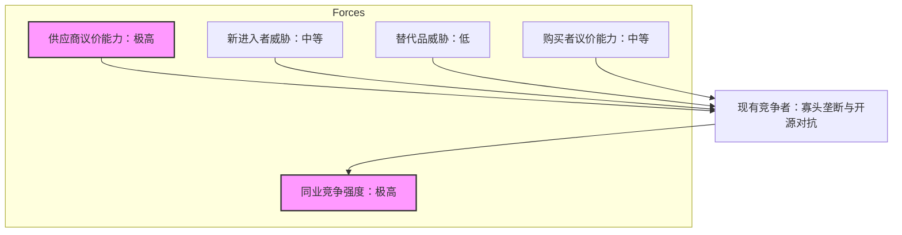

# 大语言模型技术发展趋势深度分析报告

**报告编号**：TA-2023-LLM-001  
**发布日期**：2023年10月  
**分析师**：技术分析师团队

---

## 1. 执行摘要

本报告基于PEST、波特五力及价值链分析框架，对当前大语言模型领域的技术演进与产业格局进行了系统性剖析。

**关键发现**：
1.  **技术范式的双重转向**：LLM技术正从单纯的“参数规模扩张”转向“架构效率优化”（如MoE、SSM）与“多模态融合”，Scaling Laws面临边际效应递减的挑战，高质量合成数据成为新的竞争高地。
2.  **算力霸权与生态壁垒**：英伟达构建的CUDA生态与硬件垄断构成了极高的行业护城河，但开源模型通过“推理成本倾销”正在瓦解闭源厂商的商业闭环。
3.  **应用形态的质变**：行业正从“对话框交互”向“Agentic AI（智能体）”演进，具备规划、工具调用能力的Agent将成为下一代操作系统的核心。
4.  **垂直领域的价值落地**：通用大模型在医疗、法律、金融等高知识密度领域的渗透率提升，但面临严重的“幻觉”信任危机，RAG（检索增强生成）成为企业落地的标配架构。

---

## 2. 研究范围与方法论

### 2.1 研究范围界定
-   **核心问题**：LLM技术的当前成熟度、竞争格局及未来演进方向。
-   **分析边界**：聚焦于基础模型技术架构、基础设施竞争、应用生态及宏观环境影响。
-   **关键问题**：
    -   Transformer架构的极限在哪里？
    -   算力供需矛盾的破解之道？
    -   开源与闭源模型的博弈终局？

### 2.2 分析框架组合
本报告采用复合分析框架：
-   **PEST分析**：宏观环境扫描。
-   **波特五力模型**：产业竞争格局评估。
-   **价值链分析**：从算力到应用的价值创造过程梳理。

---

## 3. 主体分析

### 3.1 宏观环境分析 (PEST)

#### 3.1.1 政治
-   **监管合规化**：欧盟《人工智能法案》与中国《生成式人工智能服务管理暂行办法》标志着LLM进入强监管时代。数据主权、隐私保护及算法偏见成为合规重点。
-   **地缘科技博弈**：高端GPU（如H100/A100）的出口管制迫使中国等地区加速自主算力生态建设，导致技术栈出现区域性分化风险。

#### 3.1.2 经济
-   **训练成本指数级增长**：GPT-4级别模型训练成本预估超过1亿美元。高门槛导致资本向头部集中，初创企业被迫转向垂直细分赛道。
-   **推理成本优化**：随着应用落地，推理成本成为企业主要OpEx，推动了量化压缩、投机采样等降本技术的普及。

#### 3.1.3 社会
-   **劳动力结构重塑**：知识密集型职业（程序员、翻译、分析师）面临替代焦虑，同时对“AI素养”人才需求激增。
-   **信任危机**：Deepfake与虚假信息泛滥引发社会对“真实性”的信任崩塌，推动了水印技术和内容溯源技术的发展。

#### 3.1.4 技术
-   **架构创新**：Transformer并非终点。Mamba/SSM（状态空间模型）架构试图解决Transformer $O(N^2)$ 的计算复杂度问题；混合专家模型成为主流架构，实现了参数规模与推理成本的解耦。

---

### 3.2 产业竞争格局分析 (波特五力模型)

#### 1. 供应商议价能力：极高
**核心论据**：目前LLM训练高度依赖英伟达GPU及CUDA软件生态。尽管AMD (MI300系列) 和 Intel 正在追赶，但软硬件适配成熟度差距显著。数据供应商（如Reddit、Stack Overflow）切断API接口或征收高额数据费，进一步增强了上游话语权。

#### 2. 购买者议价能力：中等
企业级用户具备一定议价能力，可通过私有化部署或云服务议价。但C端用户高度依赖头部模型（GPT-4, Claude 3），切换成本虽低，但使用习惯粘性高。

#### 3. 新进入者威胁：中等
虽有Llama 3等开源模型降低了技术门槛，但“数据飞轮”效应和算力投入形成了极高的资本壁垒。新进入者多通过“垂直领域微调”或“端侧模型”寻找切入点。

#### 4. 替代品威胁：低
目前尚未出现能在大规模通用语言理解与生成任务上替代LLM的技术。传统符号AI在小样本逻辑推理上有效，但缺乏泛化能力。

#### 5. 同业竞争强度：极高
OpenAI、Google、Anthropic形成闭源第一梯队；Meta通过Llama系列实行“降维打击”，意图通过开源生态通过应用层获利。价格战已开启，Tokens单价呈指数级下降趋势。

---

### 3.3 价值链分析

LLM产业价值链呈现“微笑曲线”特征：上游算力/算法与下游应用端附加值高，中游模型训练趋于同质化。

| 环节 | 关键要素 | 价值分布 | 技术趋势 |
| :--- | :--- | :--- | :--- |
| **上游：基础设施** | 芯片(GPU/TPU)、数据中心、云计算 | **极高** | HBM内存带宽、NVLink互联速率、液冷技术 |
| **中游：基础模型** | 预训练、微调、对齐(RLHF) | **中低** | MoE架构、长上下文、多模态融合 |
| **下游：应用与服务** | 垂直应用、Agent、中间件 | **高** | RAG技术、向量数据库、提示词工程 |

#### 价值链核心洞察：
-   **算力霸权**：英伟达占据了价值链中最丰厚的利润，其毛利率高达70%以上。
-   **中间层“空心化”风险**：单纯提供模型API的厂商面临价格战挤压，必须向PaaS平台或应用层延伸。
-   **数据壁垒前移**：高质量合成数据成为中游竞争的核心，谁掌握了高质量数据生产线，谁就能打破Scaling Laws的瓶颈。

---

### 3.4 技术演进趋势深度洞察

#### 1. 架构演进：从 Dense 到 Sparse
-   **现状**：GPT-3等早期模型为Dense模型，推理时激活全部参数，成本高昂。
-   **趋势**：Mistral、GPT-4等已全面转向MoE（Mixture of Experts）架构。例如，在推理时仅激活总参数量的1/8，大幅降低延迟与成本。
-   **数据支撑**：Switch Transformer论文证明，MoE可在相同计算预算下将模型容量扩大4倍以上。

#### 2. 上下文窗口的“无限”扩展
-   **现象**：Gemini 1.5 Pro支持100万+ tokens上下文，RAG（检索增强生成）的传统优势受到挑战。
-   **分析**：长上下文窗口试图替代RAG，但在海量知识检索中仍存在“迷失中间”现象。未来趋势是“长窗口 + RAG”的混合架构。

#### 3. 智能体 成为终极形态
-   **定义**：从“对话者”转变为“行动者”。
-   **技术栈**：规划 -> 工具调用 -> 反思。
-   **价值**：Agent能够自主拆解复杂任务，连接外部API，是LLM从Chatbot向操作系统内核跨越的关键一步。

---

## 4. 结论与建议

### 4.1 核心结论
1.  **摩尔定律在AI领域的映射**：模型推理成本正以每年约10倍的速度下降，这将催生大量以前因成本过高而无法落地的应用场景。
2.  **开源与闭源的动态平衡**：闭源模型将在前沿能力上保持6-12个月的领先，但开源模型将在成本敏感型和私有化部署市场占据主导。
3.  **技术护城河的转移**：模型权重的壁垒正在消融，未来的护城河将建立在**高质量专有数据**和**深度整合的业务工作流**之上。

### 4.2 可行性建议

#### 对于企业决策者：
-   **战略层面**：摒弃“造轮子”思维，优先选用开源模型（如Llama 3 70B）结合RAG架构进行私有化部署，平衡成本与数据安全。
-   **应用落地**：聚焦高ROI场景（如客服、代码生成、文档处理），建立“人机协作”的工作流，而非直接替代。

#### 对于技术研发者：
-   **技能树重构**：重点掌握RAG架构设计、Prompt Engineering进阶技巧及Agent框架开发。
-   **关注边缘计算**：随着手机/PC端NPU算力提升，端侧模型是未来两年的蓝海市场。

#### 对于投资者：
-   **关注“卖铲人”**：继续关注算力基础设施及数据合成服务商。
-   **警惕同质化**：谨慎投资仅依靠API套壳且缺乏数据飞轮效应的应用层初创公司。

---

## 5. 附录

### 参考资料来源
1.  *Attention Is All You Need*, Vaswani et al., 2017.
2.  *Switch Transformers: Scaling to Trillion Parameter Models*, Google Research, 2022.
3.  Gartner Hype Cycle for Artificial Intelligence, 2023.
4.  OpenAI, Google, Meta, Anthropic Official Technical Reports (2023-2024).
5.  NVIDIA Financial Reports & Keynotes.

### 术语表
-   **MoE (Mixture of Experts)**: 混合专家模型，一种稀疏激活的模型架构。
-   **RAG (Retrieval-Augmented Generation)**: 检索增强生成，结合外部知识库解决模型幻觉问题。
-   **RLHF (Reinforcement Learning from Human Feedback)**: 基于人类反馈的强化学习，用于对齐模型价值观。
-   **Token**: 文本处理的最小单位，通常一个Token约等于0.75个英文单词。
-   **Inference**: 推理，模型根据输入生成输出的过程。

---
*报告结束*